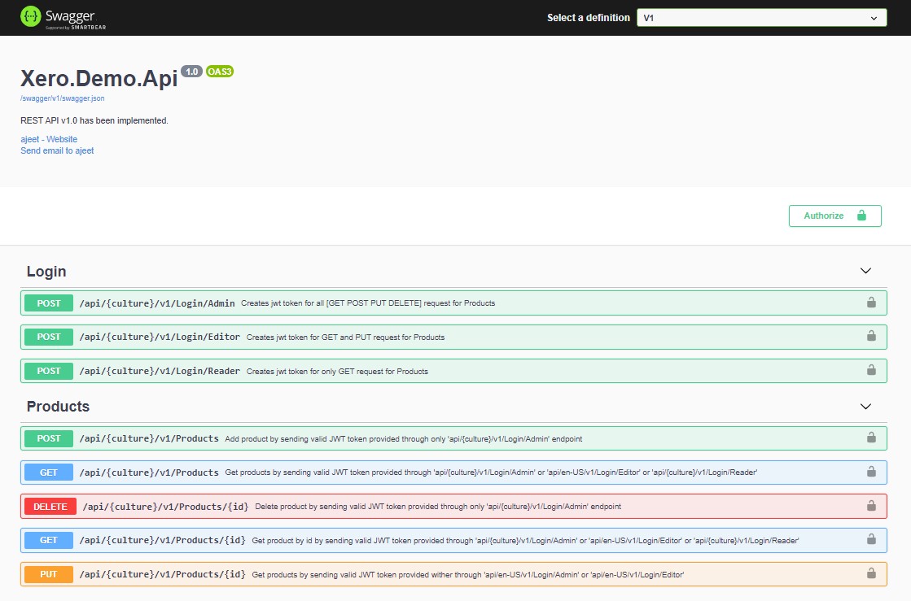
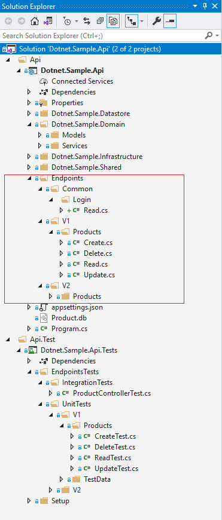

# Dotnet.Sample.Api                                                                                                                                 

  | |    | | [](https://www.codacy.com/gh/AJEETX/Dotnet.Sample.Api/dashboard?utm_source=github.com&amp;utm_medium=referral&amp;utm_content=AJEETX/Dotnet.Sample.Api&amp;utm_campaign=Badge_Grade) 
|  ---          | ---        |  ---        | --- |  --- |
    |   |  |  | [](https://codeclimate.com/github/AJEETX/Dotnet.Sample.Api/maintainability) 
 |    | [](https://visualstudio.microsoft.com/downloads/) |  [](https://dotnet.microsoft.com/download/dotnet/5.0)   |     


---------------------------------------




## Repository codebase
 
The repository consists of projects as below:


| # |Project Name | Project detail | location| Environment |
| ---| ---  | ---           | ---          | --- |
| 1 | Dotnet.Sample.Api | Dotnet5 WebApi as backend  |  **src\Api** folder | [](https://dotnet.microsoft.com/download/dotnet/5.0)|
| 2 | Dotnet.Sample.Api.Tests | Tests for webapi |  **src\Api.Test** folder | [](https://dotnet.microsoft.com/download/dotnet/5.0)| 


## Application Folder structure

---------------------------------------




---------------------------------------


### Summary

The overall objective of the applications :


Through the  endpoint A user can Login and jwt authentication is used. 

Once authorized, user can do "CRUD" operation on the  endpoint


### Setup detail

##### Environment Setup detail

> Download/install   	
>	1.	[](https://dotnet.microsoft.com/download/dotnet/5.0) to run webapi project
>   
>   2. [](https://visualstudio.microsoft.com/downloads//) to run/debug the applications
>   Or [](https://code.visualstudio.com/) to run/debug the applications
>	
>   

##### Project Setup detail

>   1. Please clone or download the repository from [](https://github.com/AJEETX/Dotnet.Sample.Api) 
>   
>   2. Create a folder and place the downloaded repository and unzip if downloaded.
>   
>   3. Open the solution file through **Visual Studio 2019** or through **Visual Studio Code** open the newly created folder where the repository is downloaded
>   
##### (a) To start the webapi
   
>   1. Through **Visual Studio 2019**, click **F5** button to run the webapi, Please make sure the webapi project is selected as startup project.
>    
>   2. Or through **Visual Studio Code**, open a command terminal by pressing the computer keyboard buttons `Control` and `~`
>
>       (a) Within the terminal, browse to folder location named as **"src\Api"** 
>  
>       (b) Restore the dependencies, type `dotnet restore` on the terminal
>
>       (c) Run the webapi project, type `dotnet run` on the terminal
>   
>   3. **WebApi** shall start running on port **5000**

```
For better experience please use chrome browser
```

##### (b) To run the unit test project
>   
>   1. Through **Visual Studio 2019**, open the **Test Explorer** and run the tests.
>   
>   2. Or through **Visual Studio Code** Open a new command terminal
>   
>       (a) Within the new terminal, browse to the folder named as **"src\Api.Test"**
>   
>       (b) To run the tests, type `dotnet test` on the terminal


-----------------------------------------------------------------------
#### To-do:
> caching
> 
> endpoint throttling/rate limit

-----------------------------------------------------------------------
  | ||
 | --- | --- | ---|


<a href="https://info.flagcounter.com/JDVj"></a>
